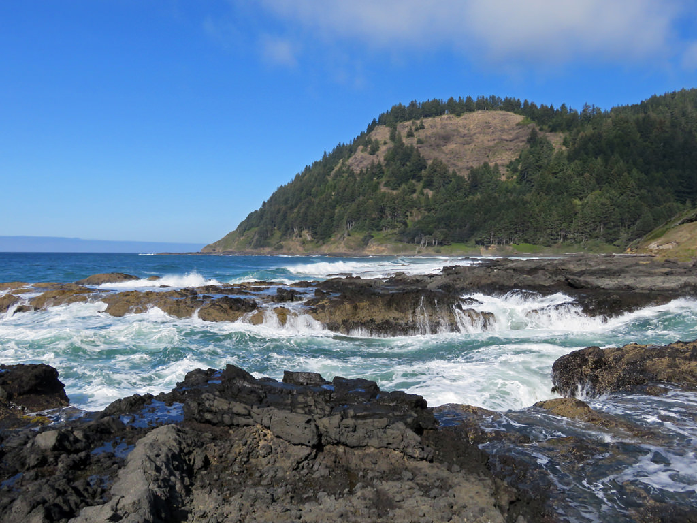

# Regional Vulnerability Assessment: Ocean Acidification in the Pacific Northwest

#### Mapping Exposure, Sensitivity, and Adaptive Capacity of Shellfish Stakeholders


### Project Description:

This interactive map is under development by a team of researchers at Oregon State University. The goal is to visualize inter-annual hotspots of ocean acidification, four shellfish species' biophysical thresholds at each life stage, and the network of shellfish stakeholders across the Pacific Northwest. The map aims to convey important information to stakeholders about their vulnerability to ocean acidification and to identify potential adaptation pathways. 

### Project Goal:

To enable public understanding of current and future OA exposure, sensitivity, and adaptive capacity of shellfish stakeholders in the Pacific Northwest.

### Background:

OA is occurring with greater intensity in the PNW than anywhere else in the world, disrupting shellfish species’ development and posing a threat to ecosystems and economies that depend on them. Shellfish form the backbone of a $280 million annual industry in the PNW, across a chain of suppliers, hatcheries, growers, processors,distributors and vendors, and central to this industry are the peoples indigenous to the PNW who have placed special economic and cultural value on shellfish for millennia. The PNW is both a harbinger of things to come for other coastlines that will ultimately face OA exposure, and a laboratory for innovation on successful adaptation investments and strategies. The lessons we learn here about OA vulnerability can serve as guideposts for other people and institutions facing these threats in coming decades


*Damage to oyster larvae from acidified water (right) compared to healthy larvae (left). Micrograph: OSU.*

### Research Objectives:

- Assess ocean acidification (OA) vulnerability of stakeholders in the Pacific Northwest
- Identify pathways for OA adaptation
- Assess costs of adaptation
- Identify barriers and limits to adaptation that can be overcome to avoid adverse consequences of OA to shellfish dependent people.

Researchers and OA stakeholders at Oregon State University and the Pacific Shellfish Institute have partnered with NOAA to identify pathways for OA adaptation in the PNW by: Developing interactive mapping tools to enable public understanding of current and future OA exposure and sensitivity in the PNW; build bioeconomic models of shellfish aquaculture firms facing OA risk to quantify the potential value of adaptation; identify key technological,institutional, legislative, financial and cultural barriers to OA adaptation;identify feasible potential long-term pathways to successful OA adaptation that reduce the potential for harmful outcomes; evaluate the value of potential adaptation pathways; develop behavioral models to predict the likelihood of users adopting feasible pathways.

### Technical Summary:

##### System Architecture

This data and HTML files for this project are hosted on the web via GitHub, and the map utilizes several external JavaScript libraries from the web for visualization and interactivity (see *Libraries*). Web users that visit https://briangkatz.github.io/rva-oa/ to view the map also send a Web Map Service (WMS) request to Mapbox to load a custom base map as a Leaflet tile layer.

##### Main Functions

- Zoom to Region

  - Dropdown menu allows users to quickly navigate to a region of interest

  - First create the fly() function and set the bounds you want to zoom to on the map:

  - ```javascript
    function fly10() { // Central Oregon Coast
        map.fitBounds([
            [44.3856, -124.3714],
            [43.1641, -123.4847]
        ])
    }
    ```


  - Then call the fly() function from within your HTML page to zoom on click

  - ```html
    <!--Central Oregon Coast-->
    <div class="col-md-4 col-lg-4 map" onclick='fly10();'>
        
        <div class="overlay-1x3">
            <div class="text">
                <h6><a href="#" class="navtext">Central Coast</a></h6>
            </div>
        </div>
    </div>
    ```

- Species Thresholds (in development)

  - Goal is for users to filter the view how an area's exposure to OA varies based on the varied sensitivities of four shellfish species

- Magnitude, Frequency, and Time Slider

  - Dynamic cross-filtering of OA exposure data on map based on magnitude, frequency, and time

  - ```javascript
    // Coordinated View Geovisualization
    var arag_events = d3.json('assets/data/corrosive_arag.geojson').then(function(data) {

        var filter = crossfilter(data.features);

        var all = filter.groupAll();

        var everything = filter.dimension(function(d) {
            return d
        });

        var geomDimension = filter.dimension(function(d) {
            return d.geometry
        });

        var magDimension = filter.dimension(function(d) {
            var min_arag = d.properties.min_arag;
            return min_arag < 0.9 ? '0.75-0.90' :
                min_arag < 1.05 ? '0.90-1.05' :
                    min_arag < 1.2 ? '1.05-1.20' :
                        min_arag < 1.35 ? '1.20-1.35' :
                            '1.35-1.40'
        });

        var depthDimension = filter.dimension(function(d) {
            var freq = d.properties.freq;
            return freq < 5 ? '0.00-0.05' :
                freq < 10 ? '0.05-0.10' :
                    freq < 15 ? '0.10-0.15' :
                        freq < 20 ? '0.15-0.20' :
                            '>0.20'
        });

        var dateDimension = filter.dimension(function(d) {

            return d3.timeDay(new Date(d.properties.time_max));
        });

        var magDimensionGroup = magDimension.group();

        var depthDimensionGroup = depthDimension.group();

        var dateDimensionGroup = dateDimension.group(); //

        var geoJsonLayer = L.geoJson({
            type: 'FeatureCollection',
            features: geomDimension.top(Infinity)
        }, {
            pointToLayer: function(feature, latlng) {
                return L.circleMarker(latlng, {
                    radius: Math.pow(feature.properties.min_arag, -5) * 5,
                    fillColor: "red",
                    color: "#fff",
                    weight: 5,
                    stroke: false,
                    opacity: 0.5,
                    fillOpacity: 0.5
                })
            },
            onEachFeature: function(feature, layer) {
                layer.bindTooltip("&Omega; Aragonite: " + feature.properties.min_arag.toString());
            }
            }).addTo(map);

        var magChart = dc.barChart('#mag-chart');

        magChart
            .height(150)
            .margins({
                top: 10,
                right: 10,
                bottom: 40,
                left: 40
            })
            .dimension(magDimension)
            .group(magDimensionGroup)
            .elasticY(true)
            .x(d3.scaleOrdinal())
            .xUnits(dc.units.ordinal)
            .yAxis()
            .ticks(3);

        var depthChart = dc.barChart('#depth-chart');

        depthChart
            .height(150)
            .margins({
                top: 10,
                right: 10,
                bottom: 40,
                left: 40
            })
            .dimension(depthDimension)
            .group(depthDimensionGroup)
            .elasticY(true)
            .x(d3.scaleOrdinal())
            .xUnits(dc.units.ordinal)
            .yAxis()
            .ticks(3);
    ```


        var dateChart = dc.lineChart('#date-chart');
    
        dateChart
            .renderArea(true)
            .height(150)
            .transitionDuration(1000)
            .margins({
                top: 10,
                right: 10,
                bottom: 40,
                left: 40
            })
            .dimension(dateDimension)
            .group(dateDimensionGroup)
            .elasticY(true)
            .yAxisPadding('40%')
            .x(d3.scaleTime().domain([new Date(1994, 12), new Date(2051, 1)]))
            .xUnits(d3.timeYears);
    
        dc.renderAll();
    
        dateChart.renderlet(function (chart) {
            // rotate x-axis labels
            chart.selectAll('g.x text')
                .attr('transform', 'translate(-10,10) rotate(315)');
            chart.selectAll('g.y text')
                .attr('line-height', '3')
        });
    
        function updateMapFilter() {
            geomDimension.filter(function(d) {
                return map.getBounds().contains(L.geoJSON(d).getBounds())
            });
            dc.redrawAll();
        }
    
        function updateMap() {
            geoJsonLayer.clearLayers();
            geoJsonLayer.addData({
                type: 'FeatureCollection',
                features: everything.top(Infinity)
            });
        }
    
        map.on('zoomend moveend', function() {
            updateMapFilter();
        });
    
        magChart.on('filtered', function(chart, filter) {
            updateMap()
        });
    
        depthChart.on('filtered', function(chart, filter) {
            updateMap()
        });
    
        dateChart.on('filtered', function(chart, filter) {
            updateMap()
        });
    
    });
    ```

- Vulnerability Layers Toggle

  - Show or hide different data layers or base maps

  - ```javascript
    // Layer control
    var hexagons = L.layerGroup([geojson]);
    var arag_qtiles = L.layerGroup([arag2050]);
    var stakeholder_groups = L.layerGroup([stakeholders]);
    var ac_hexLayer = L.layerGroup([hexLayer]);

    var base_maps = {
        "Shellfish": mapbox_shellfish,
        "Satellite": mapbox_satellite
    };

    var vulnerability_layers = {
        "Exposure": arag_qtiles,
        "Sensitivity": stakeholder_groups,
        "Adaptive Capacity": ac_hexLayer,
        "Combined Vulnerability": hexagons
    };

    L.control.layers(base_maps, vulnerability_layers, {
            position: 'topright',
            collapsed: true
        }).addTo(map);
    ```

- Mobile-Friendly Interface

  - Responsive design allows users to interact with map on any device
  - 

### Sketch:


### Design Scheme:

##### Color Palettes

[Basemap Palette](https://coolors.co/3b5f5b-8cb4cc-c9f5f6-acbc94-a9935c)


[Thematic Layers Palette](https://coolors.co/e0631d-a5bf15-e3ed00-ffffff-c9f5f6)


##### Fonts

Interface - [Oswald](https://fonts.google.com/specimen/Oswald)

```html
<link href="https://fonts.googleapis.com/css?family=Oswald" rel="stylesheet">
```

Basemap - [MixLean](https://www.dafont.com/mixlean.font)

##### Icons

[Font Awesome](https://fontawesome.com/icons?d=gallery)

```html
<link href="css/font-awesome.min.css" rel="stylesheet" type="text/css">
```

##### Multimedia

Larval and adult Pacific oyster graphics designed by [Ginny Katz](https://www.linkedin.com/in/virginiakatz/)

OSU Cartography & Geovisualization logo by [Bo Zhao](http://geoviz.ceoas.oregonstate.edu/)

### Data Sources:

Projected Aragonite:

- [Hauri et al. 2013](https://agupubs.onlinelibrary.wiley.com/doi/full/10.1002/grl.50618)

Shellfish Stakeholders:

- [Pacific Coast Shellfish Growers Association](www.pcsga.org/search-our-growers)

Funded OA Projects:

- [Oregon OAH Council](http://oregonocean.info/index.php/ocean-acidification/85-oa-coord-council)

Hexagons:

- via [MMQGIS plug-in for QGIS](https://plugins.qgis.org/plugins/mmqgis/)

Estuarine Bathymetric Digital Elevation Models:

- [NOAA NCEI](https://www.ngdc.noaa.gov/mgg/bathymetry/estuarine/index.html)

Rivers and Lakes:

- [USGS](https://www.sciencebase.gov/catalog/item/4fb55df0e4b04cb937751e02)

Species Distribution Data:

- [*C. gigas*](https://doi.org/10.15468/dl.2a2vv8)
- [*M. californianus*](https://doi.org/10.15468/dl.7d325n)
- [*O. lurida*](https://doi.org/10.15468/dl.o40zcw)
- [*M. galloprovincialis*](https://doi.org/10.15468/dl.jpdpsf)

### Favicon:

Shellfish favicon sourced from [Pixabay](https://pixabay.com/p-576545/?no_redirect)

### Libraries:

[Leaflet](www.leafletjs.com) | [Bootstrap](www.getbootstrap.com)| [Storymap.js](www.github.com/jakobzhao/storymap) | [Chroma.js](https://cdnjs.cloudflare.com/ajax/libs/chroma-js/1.3.4/chroma.min.js) | [Font Awesome](https://use.fontawesome.com/releases/v5.0.8/js/all.js) | [RBush.js](https://unpkg.com/rbush@2.0.1/rbush.min.js) | [Labelgun.js](https://unpkg.com/labelgun@6.0.0/lib/labelgun.min.js) | [D3](https://d3js.org/d3.v5.min.js) | [DC](https://dc-js.github.io/dc.js/js/dc.js) | [Crossfilter](https://dc-js.github.io/dc.js/js/crossfilter.js) | [Hexbin](https://d3js.org/d3-hexbin.v0.2.min.js) | [Mapbox GL](https://api.tiles.mapbox.com/mapbox-gl-js/v0.45.0/mapbox-gl.js)

### Web Services:

[GitHub](www.github.com) | [Mapbox](www.mapbox.com)

### Credits:

##### Author

[Brian Katz](mailto:katzbr@oregonstate.edu), Graduate Research Assistant and M.S. Geography Student at Oregon State University

##### Research Team

[David Wrathall](mailto:wrathald@oregonstate.edu) (PI)

[David Kling](mailto:klingd@oregonstate.edu) (Co-PI)

[George Waldbusser](mailto:waldbuss@coas.oregonstate.edu)

[Brian Katz](mailto:katzbr@oregonstate.edu) (Graduate Research Assistant - Wrathall)

[Jessamyn Johnson](mailto:johnjes7@oregonstate.edu) (Graduate Research Assistant - Waldbusser)

[Bobbi Hudson](mailto:bobbi@pacshell.org) (Pacific Shellfish Institute)

### Acknowledgement:

Thank you David and NOAA for the incredible opportunity to be a part of this research project. Thank you Bo for your constructive critique and guidance toward the cutting-edge of web-based cartography. I especially want to thank Ginny for her endless support and assistance through many long nights of working on this project.